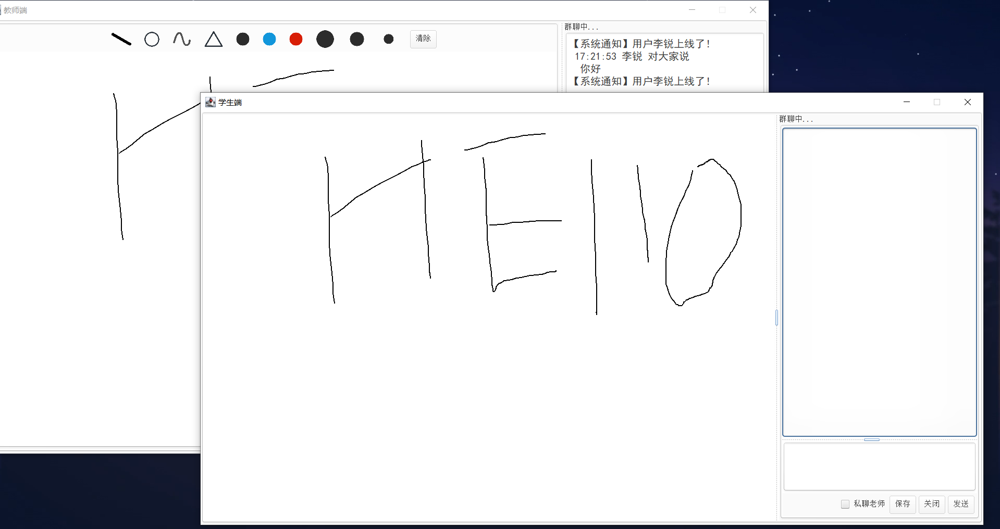

# WhiteBoard

## 功能：

- 教师端：
  - 使用多种工具、画笔绘制图片
  - 给所有学生发送消息
  - 清除画板
  - 向学生发送文件
  - 保存绘制的内容
- 学生端：
  - 输入姓名登录到教室
  - 获取老师绘制的内容
  - 接收老师的文件，选择保存的路径
  - 私信老师

## 运行：

1. 将lib/ninepatch4j.jar包设置为依赖；
2. 设置SDK未1.8；
3. 分别运行学生端和教师端，学生端需要后运行，教师端先运行。